# Screenshot Features

---

## Seeding - Fixtures

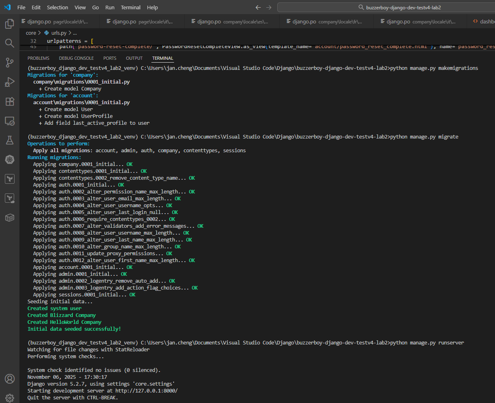

---

## Register

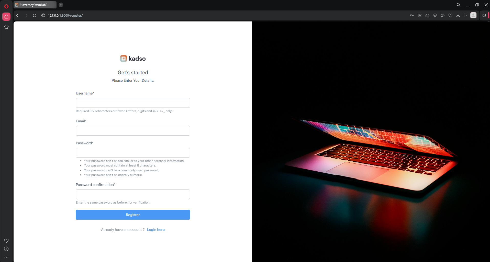

---

## Login

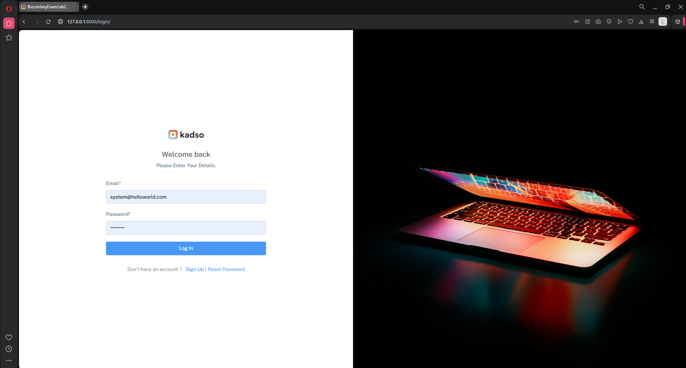

---

## Password - Reset

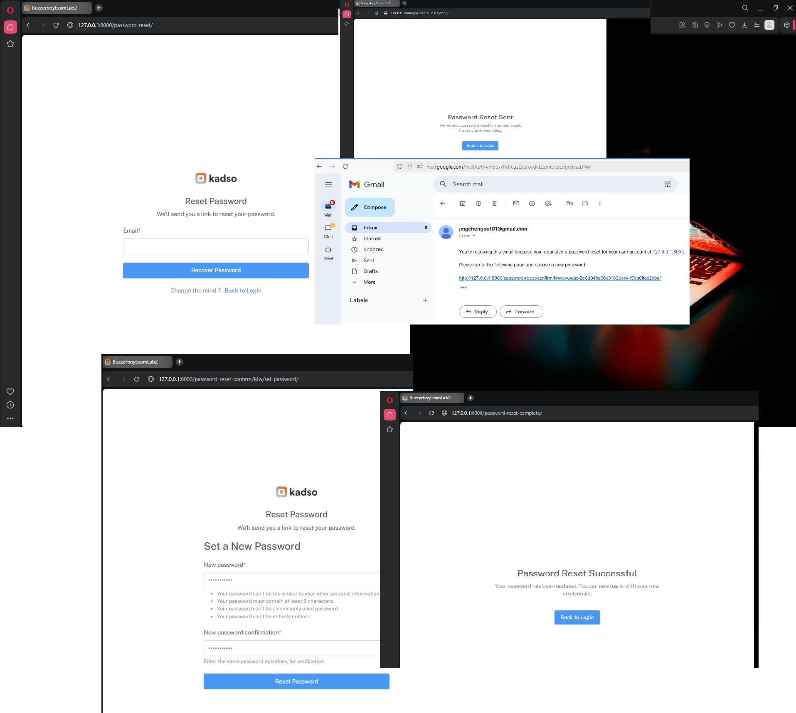

---

## Homepage/Dashboard

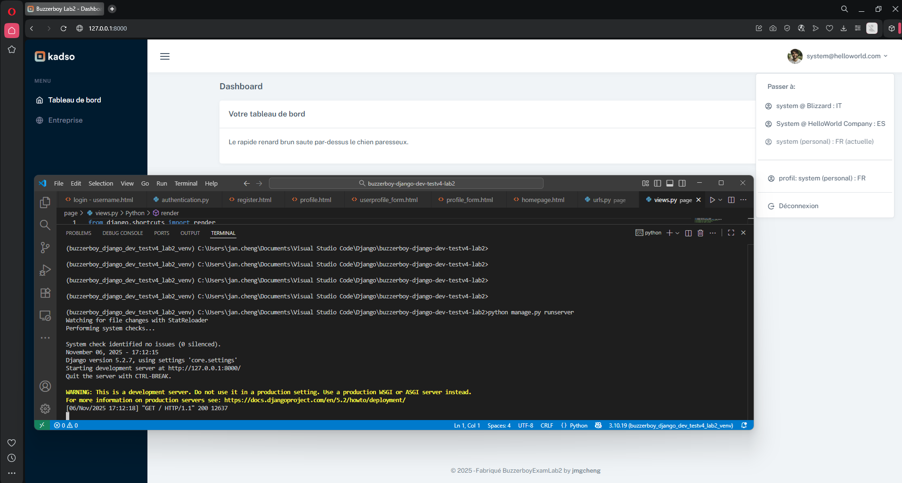

---

## Profile

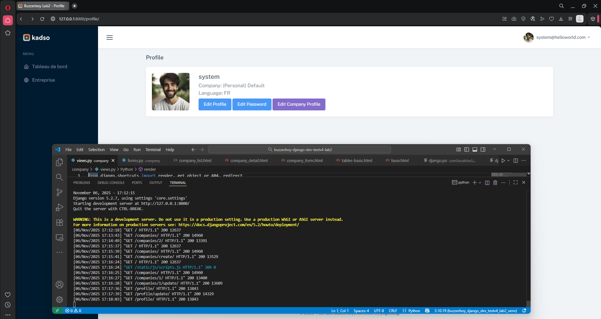

---

## Profile - Update

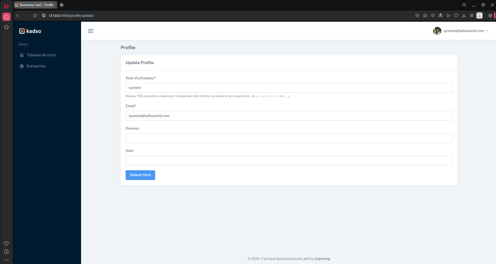

---

## Password - Update

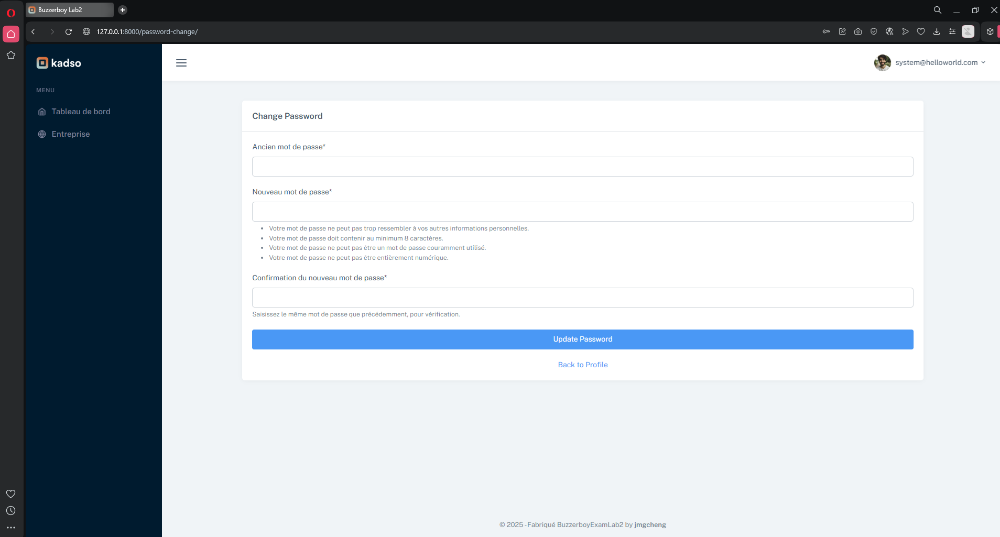

---

## Company - Create

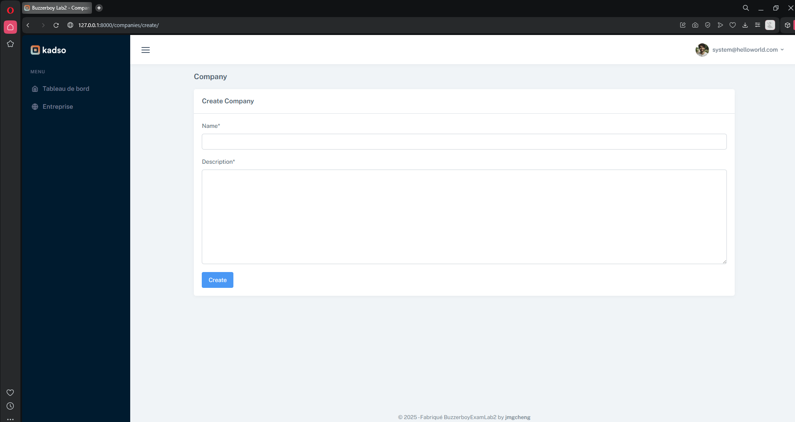

---

## Company - Detail


---

## Company - List

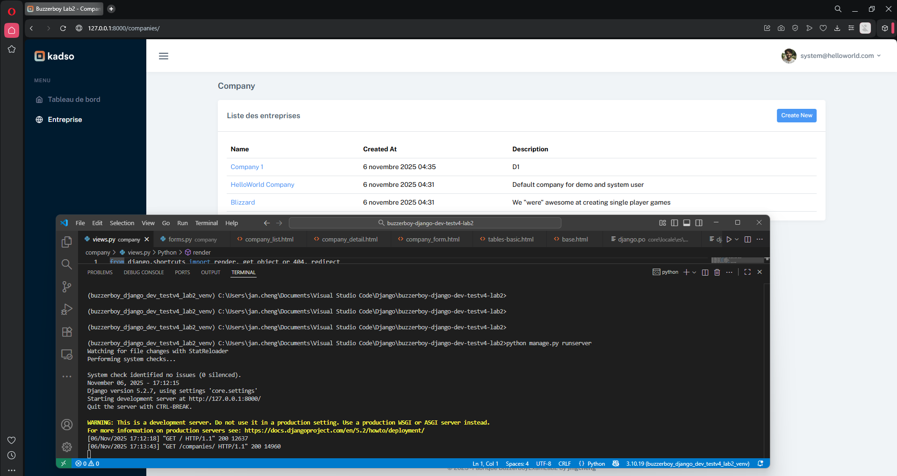

---

## Company - Update


---

## UserProfile - Update Language preference

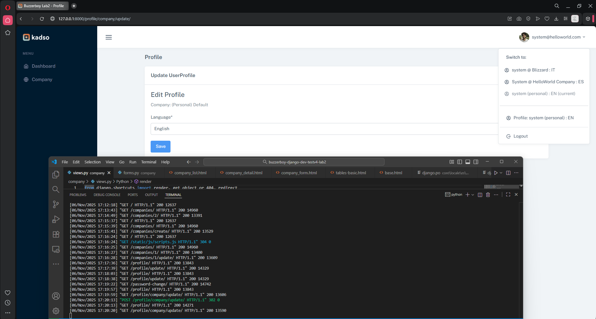

---

---

---

## Clone Project

```
git clone https://github.com/jmgcheng/buzzerboy-django-dev-testv4-lab2.git
cd buzzerboy-django-dev-testv4-lab2
```

## Setup

```
python -m venv venv
venv\Scripts\activate
python manage.py makemigrations
# migrate will run seed if database is new
python manage.py migrate
```

## Run

```
python manage.py runserver
```

## Need to run specific Python environment?

Use Conda

```
conda create -n venv_conda_3.10 python=3.10 -y
conda activate venv_conda_3.10
```
